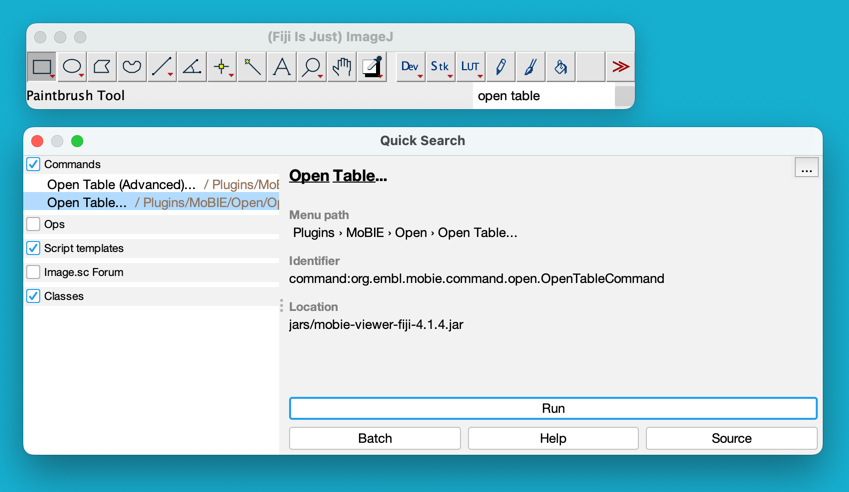
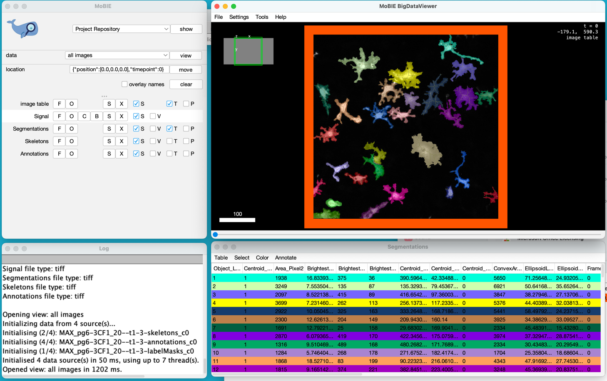
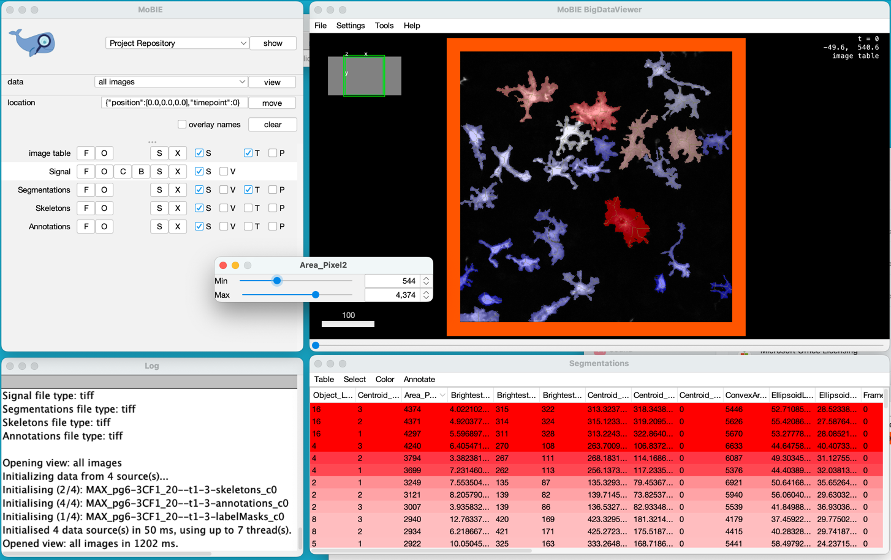

# Microglia Morphometry

A Fiji plugin for semi-automated segmentation, tracking and morphometric analysis of microglia cells in 2D images.

## Publication

Soon to come....

## Installation

- Install [Fiji](https://fiji.sc/)
- Start Fiji and [add the following update sites](https://imagej.net/How_to_follow_a_3rd_party_update_site):
  - [X] Microglia-Morphometry
  - [X] IJPB-Plugins
- Restart Fiji

## Quick start

- [Download example ImageJ macros](https://github.com/embl-cba/microglia-morphometry/raw/main/scripts/scripts.zip)
  - Unzip
- Drag and drop one of the macros onto Fiji and click [ Run ] in the script editor.

## Screenshots

### Manual correction of the automated segmentation

### Automated skeletonization

</a>

## Plugins > Microglia > New Microglia Segmentation And Tracking

Semi-automated microglia segmentation and tracking.

Input:
- Single color TIFF stack time lapse with microglia signal, each TIFF plane corresponding to one time point
    - [Example intensity image input](https://github.com/embl-cba/microglia-morphometry/raw/main/src/test/resources/data/MAX_pg6-3CF1_20--t1-3.tif)

Output:
- TIFF stack with label mask images, each TIFF plane corrsponding to one time point. Cells keep their label across time, thereby encoding the tracking results.
    - [Example label mask output](https://github.com/embl-cba/microglia-morphometry/raw/main/src/test/resources/data/MAX_pg6-3CF1_20-labelMasks--t1-3.tif)

In addition there also is **Plugins > Microglia > Continue Microglia Segmentation And Tracking**, which allows one to continue from a partially exiting label mask that does not yet contain all the time points.

### Parameters

There are few parameters that can be set to adapt the algorithm to different cell types. Below are the values that were used for this publication. 

- `minimal_microglia_size` = 200 micrometer^2
- `skel_maxLength` = 450 micrometer

Note: Those parameters are currently hardcoded, but we could expose them in the plugin's user interface.

### Automated semantic segmentation (conversion to binary masks)

For all time points, the images are smoothed using an anisotropic diffusion filter ([www](https://imagej.net/plugins/anisotropic-diffusion-2d), [doi](https://doi.org/10.1109/tpami.2005.87)) and then individually binarised by means of an intensity threshold that is determined automatically from the respective image intensity histogram: The intensity at the histogram mode (`intensity_mode`) is computed as well as the right hand side (towards higher intensities) intensity where the count decreases to half the count at the mode (`intensity_rightHandHalfMode`). The threshold is then computed as `intensity_mode + 1.5 *( intensity_rightHandHalfBin - intensity_mode )`. On the resulting binary image connected components smaller than `minimal_microglia_size` are removed.

### Semi-automated instance segmentation and tracking

The instance segmentation (object detection) and tracking are linked and preformed with human interaction. The main challenge here is that microliga can be touching making it difficult to separate them fully automatically. 
To address this challenge, the binary mask is first subjected to an automated object splitting algorithm, followed by the opportunity to manually correct the segmentation. 

### Automated object splitting

The binary masks are converted to label masks using connected component analysis. Each connected component is skeletonized and the total skeleton length (`skel_length`) is measured. A likely number of microglia within each connected component is computed as `n = ceil( skel_length / skel_maxLength)`. For each connected component with `n > 1` the position of local intensity maxima (corresponding to likely microglia soma) is computed. The `n` brightest local intensity maxima are used as seed points to split the connected component using an intensity based watershed algorithm. Splits are only accepted if the resulting objects are larger than `minimal_microglia_size`.

### Manual label mask correction 

For each time point, the result of above automated steps are presented to the user for manual correction. The user sees the intensity image and the label mask image side by side and the ability to draw into the label mask image. Using the ImageJ ROI tools one can select a region and either set pixels to 0 or 1. Clicking the "Update labels" button will then first convert the corrected label mask image to a binary image and then recompute a new label mask image. Thus, in effect, setting pixels to 0 can be used to split or remove (parts of) cells and settings pixels to 1 can be used to join or add cells.

### Automated tracking and splitting

Once the above manual segmentation correction is finished the user clicks the "Next frame" button. This will trigger the tracking of cells from the current frame (`t`) to the next frame (`t+1`). In frame `t+1` the algorithm starts from the automatically segmented cells as explained above. Next, it takes into account the (manually corrected) information from the current frame `t` to split cells that are likely wrongly connected in frame `t+1`. To do so, for each connected component in frame `t+1` it determines the potentially multiple label regions that it overlaps with in frame `t`. Using those overlap regions as seeds it performs a watershed splitting to draw dividing lines in frame `t+1`. Using the resulting binary mask image it then assigns the labels in frame `t+1` based on the label that each connected component maximally overlaps with in frame `t`. If the overlap is zero, a new label index will be assigned. This way of assinging the label indices in frame `t+1` implements the tracking such that cells belonging to one track have the same label index throughout the time series. 

### Saving the label mask images

The output of the segmentation and tracking are a label mask TIFF stack, with each TIFF plane corresponding to one time point. This label mask stack can be saved by clicking the "Save" button. The "Stop and save" button also terminates the program and closes the user interface windows.

## Plugins > Microglia > Continue Microglia Segmentation And Tracking

Semi-automated microglia segmentation and tracking. This command implements the same functionality as the one described above [ Plugins > Microglia > New Microglia Segmentation And Tracking ]. However, one can continue working on a partially finished segmentation. 

The segmentation will continue on the last frame of the label mask image. Note that this allows to also correct the segmentation of a data set only containing a single frame.

Input:
- Single color TIFF stack time lapse with microglia signal, each TIFF plane corresponding to one time point
    - [Example intensity image with 5 frames](https://github.com/embl-cba/microglia-morphometry/raw/main/src/test/resources/data/MAX_pg6-3CF1_20--t1-5.tif)
- TIFF stack with label mask images, each TIFF plane corrsponding to one time point. That is, the output of this command however, typically only partially finished with **less** frames than the input.
    - [Example label mask image with 3 frames](https://github.com/embl-cba/microglia-morphometry/raw/main/src/test/resources/data/MAX_pg6-3CF1_20-labelMasks--t1-3.tif)

Output:
- Same as in [ Plugins > Microglia > New Microglia Segmentation And Tracking ]

## Plugins > Microglia > Measure Microglia Morphometry

The intensity and corresonding label mask images are used to compute shape and intensity features for each segmented cell.

Input:
- Single color TIFF stack time lapse with microglia signal, each TIFF plane corresponding to one time point
    - [Example intensity input](https://github.com/embl-cba/microglia-morphometry/raw/main/src/test/resources/data/MAX_pg6-3CF1_20--t1-3.tif)
- TIFF stack with label mask images, each TIFF plane corrsponding to one time point. Cells keeping their label across time, thereby encoding the tracking results .
    - [Example label mask output](https://github.com/embl-cba/microglia-morphometry/raw/main/src/test/resources/data/MAX_pg6-3CF1_20-labelMasks--t1-3.tif)

Output:
- CSV file containing various cell shape and intensity features (see below for details)
    - [Example cell features CSV](https://github.com/embl-cba/microglia-morphometry/raw/main/src/test/resources/data/MAX_pg6-3CF1_20-labelMasks--t1-3.tif.csv)
- TIFF stack with point annotation images, each TIFF plane corrsponding to one time point.
    - [Example annotation output](https://github.com/embl-cba/microglia-morphometry/raw/main/src/test/resources/data/MAX_pg6-3CF1_20-labelMasks--t1-3.tif-annotations.tif)
- TIFF stack with cell skeleton images, each TIFF plane corrsponding to one time point.
    - [Example skeleton output](https://github.com/embl-cba/microglia-morphometry/raw/main/src/test/resources/data//MAX_pg6-3CF1_20-labelMasks--t1-3.tif-skeletons.tif)

### Microglia morphometry features

#### Units nomenclature

- _Frames: time point
- _Pixel: length in pixel units
- _Pixel2: area in pixel units

#### Features

The CSV file contains columns for the following features:

- MorpholibJ features ([www](https://imagej.net/plugins/morpholibj), [doi](https://doi.org/10.1093/bioinformatics/btw413)):
    - Object_Label: The cell's label index, as in the corresponding label mask image.	
    - GeodesicDiameter_Pixel: The longest shortest path bewteen any two points in the cell.
    - LargestInscribedCircleRadius_Pixel: The radius of the largest disk that can be enclosed within the corresponding cell.
    - Perimeter_Pixel: The length of the cell's perimeter.
    - Area_Pixel2: The cell's area.	
    - ConvexArea_Pixel2: The area of the cell's convex hull.
    - EllipsoidLongestAxisRadius_Pixel,	EllipsoidShortestAxisRadius_Pixel: The length of the longest and shortest axis of an elliposid that is fit to the cell's pixels. 
- Skeleton features ([www](https://imagej.net/plugins/analyze-skeleton/?amp=1), [doi](https://doi.org/10.1002/jemt.20829)):
    - SkeletonAvgBranchLength_Pixel: The average length of all skeleton branches within the cell.
    - SkeletonLongestBranchLength_Pixel: The length of the shortest branch.
    - SkeletonNumBranchPoints: The number of branches.
    - SkeletonTotalLength_Pixel: The summed up length of all branches.
- Custom features:   
    - Centroid_X_Pixel, Centroid_Y_Pixel, Centroid_Z_Pixel: The coordinates of the cell's centroid.
    - Centroid_Time_Frames: The cell's time point in the TIFF stack.
    - BrightestPoint_X_Pixel, BrightestPoint_Y_Pixel: The coordinates of the brigthest point within the cell, as determined after blurring the image with a Gaussian filter with a sigma of 3 pixels. This is useful to determine the likely position of the cell's soma.
    - BrightestPointToCentroidDistance_Pixel: The distance of the cell's brightest point to its centroid.
    - RadiusAtBrightestPoint_Pixel: The distance from the cell's brightest point to the closest point outside the cell. The motivation to add this feature was to get a measurement that could represent the size of the cell's soma.
    - ImageBoundaryContact_Pixel: The number of pixels of the cell that are at the image boundary. This is useful to reject cells from the statistical analysis that are not fully in the image and therefore have compormised shape and intensity measurements.
- Other columns:
    - FrameInterval, FrameInterval_Unit: Temporal calibration of the image.
    - VoxelSpacing_Unit, VoxelSpacing_X, VoxelSpacing_Y, VoxelSpacing_Z: Spatial calibration of the image.
    - Path_LabelMasks, Path_Intensities, Path_Skeletons, Path_Annotations: Relative paths to all associated images. This is useful for downstream analysis and visualisation. 	

#### Suggested derived features

It can be useful to compute derived features, e.g. using a statistical data analysis software such as [R](https://www.r-project.org/).

For example:

- Solidity = Area_Pixel2 / ConvexArea_Pixel2
- Roundness = Area_Pixel2 / EllipsoidLongestAxisRadius_Pixel^2
- Roundness2 = Area_Pixel2 / EllipsoidShortestAxisRadius_Pixel^2
- GeodesicElongation = GeodesicDiameter_Pixel^2 / Area_Pixel2
- AspectRatio = LargestInscribedCircleRadius_Pixel^2 / Area_Pixel2
- Circularity = Area_Pixel2 / Perimeter_Pixel^2
- Somaness = RadiusAtBrightestPoint_Pixel^2 / Area_Pixel2
- Branchiness = SkeletonNumBranchPoints / GeodesicDiameter_Pixel
- Straightness = SkeletonLongestBranchLength_Pixel^2 / Area_Pixel2
- Thickness = Area_Pixel2 / SkeletonTotalLength_Pixel^2

## Data exploration and downstream analysis

### Segmentation Annotator (Fiji)

- Open Fiji and install the update site:
  - [X] Segmentation-Annotator
- [Download](https://github.com/embl-cba/microglia-morphometry/raw/main/src/test/resources/data/MAX_pg6-3CF1_20--t1-3.zip) an example data set, including the input intensity images, output segmentation images and results table.
  - Unzip 
- Open the table in the [Segmentation Annotator](https://github.com/tischi/segmentation-annotator#segmentation-annotator) as shown below

#### Open dataset from table

#### Random segment coloring

#### Coloring by cell size

### Image Data Explorer (R)

- [Download](https://github.com/embl-cba/microglia-morphometry/raw/main/src/test/resources/data/MAX_pg6-3CF1_20--t1-3.zip) an example data set, including the input intensity images, output segmentation images and results table.
- ...

